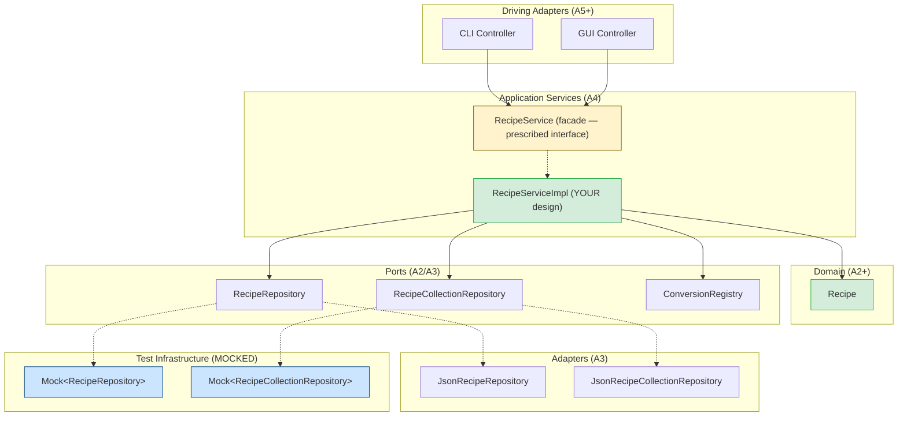

:::warning Preliminary Content

This assignment is preliminary content and is subject to change until the release date of the assignment.

:::

## Overview

In this assignment, you'll build **`RecipeService`** — the application layer that sits between user interfaces (CLI, GUI) and your domain model. This facade coordinates everything: parsing recipe text, transforming quantities, persisting to repositories, and aggregating shopping lists. It's the "brain" that the CLI (A5) might call to get things done.

![8-bit lo-fi pixel art illustration for a programming assignment cover. Kitchen/bakery setting with warm wooden cabinets and countertops in browns and tans. Scene composition (left to right): Chaotic inputs arriving at the kitchen: (1) messy handwritten recipe cards with scribbled text like "2 cups flour", "salt to taste", (2) plain text documents floating in, (3) JSON file icons. These represent unstructured recipe data. The pixel art chef stands at a large "Service Station" counter (like a prep station in a commercial kitchen). The station has a conveyor belt labeled "RecipeService" with organized compartments showing the workflow: PARSE → TRANSFORM → SAVE. Above the station, a clipboard shows an interface spec titled "RecipeService.java" with visible method signatures: "importFromText()", "scaleRecipe()", "generateShoppingList()". Crossed out in red are cleaner alternatives written below like "parseRecipe()" and "saveRecipe()" as separate methods — representing how the inherited interface bundles too much into single calls. The robot AI assistant helps the chef at the station, organizing ingredients and pointing to different methods. Clean outputs emerge: (1) structured Recipe cards neatly filed in a repository cabinet, (2) a shopping list notepad showing combined ingredients like "5 cups flour", (3) scaled recipes with "Serves: 8" visible. POST-IT NOTES: Yellow sticky reading "Build the service. Test with fakes." and another saying "Not ideal design — make it work anyway!" TOP BANNER: Metallic blue banner with white pixel text "A4: RecipeService Facade". BOTTOM TEXT: "CS 3100: Program Design & Implementation 2". SUBTLE DETAILS: Small parsing bubbles showing "2 cups flour" being broken down into quantity/unit/name components, a magnifying glass over the spec clipboard representing "understand the interface first". Color palette: Warm browns/tans for kitchen, cyan/teal for data flow and service station glow, cream for recipe cards, yellow for sticky notes. Same visual style as A3 persistence cover.](/img/assignments/web/a4.png)

The core challenge is **parsing and coordination**. Your service must parse messy text like `"2 1/2 cups flour, sifted"` into structured domain objects, then orchestrate saving recipes, updating collections, and combining ingredients into shopping lists. One method call does a lot — that's what makes it convenient for callers but challenging to implement well.

:::caution RecipeService is NOT Ideal Design

The `RecipeService` interface is **intentionally not an example of good API design**. It's an arbitrary specification you've been given — the kind of "convenient but problematic" facade you might inherit on a real project. Your job is to implement it correctly while keeping your internal design clean.

Don't use this as a model for your own API designs. Instead, recognize the patterns that make it hard to test and maintain — and practice building clean implementations behind messy interfaces.

:::

**How do you verify a service like this works?** You'll learn to use **mocks** — test doubles that stand in for real dependencies during testing. Using Mockito, you'll mock the repository interfaces to test your service in isolation, verifying both the outcomes and the interactions with dependencies.

**Due:** Thursday, February 26, 2026 at 11:59 PM Boston Time

**Prerequisites:** This assignment builds on the A3 sample implementation (provided). You should be familiar with the hexagonal architecture established in A3: `RecipeRepository`, `RecipeCollectionRepository`, and their JSON adapters. You'll also use `ConversionRegistry` from A2.

### At a Glance

**What you'll build:** A `RecipeService` facade (6 methods) that coordinates parsing, transformation, persistence, and aggregation.

**The main challenge:** Parsing recipe text and ingredient strings into structured domain objects, then orchestrating multi-step operations (parse → save → update collection).

**What you'll test:** Unit tests for `RecipeService` using Mockito to mock repository dependencies.

**How you'll be graded:** 76 pts automated (facade correctness + logging + test quality via mutation testing), 24 pts reflection, minus up to 36 pts for design/quality issues. See [Grading Rubric](#grading-rubric).

**Development strategy:** Start with simpler methods, build up to parsing. Test as you go with mocks. Submit early — the autograder tests your facade.

:::tip How to Succeed on This Assignment

This assignment is about **building a service layer** — the glue between user interfaces and your domain. Here's a strategy:

1. **Read the `RecipeService` interface carefully.** Understand what each method must accomplish before you start coding. The interface is your specification.

2. **Start simple, build up.** Implement `findByIngredient` and `importFromJson` first — they're straightforward. Then tackle parsing (`importFromText`) and aggregation (`generateShoppingList`).

3. **Parsing is the core challenge.** Invest time in understanding the ingredient parsing requirements. Break down `"2 1/2 cups flour, sifted"` → quantity type, amount, unit, name, preparation.

4. **Test with mocks.** Use Mockito to mock repository dependencies. Verify your service calls the right methods with the right arguments, and returns the expected results.

5. **Submit early and often.** The autograder tests your facade. Early feedback helps you catch issues before the deadline.

:::

:::danger Start Early — This Is About Learning, Not Just Coding

**Starting early isn't about needing more hours to code** — it's about giving yourself time to *think*, get stuck productively, and get help when you need it.

This assignment involves design decisions and tricky parsing logic. You'll hit moments where something doesn't work and you're not sure why. That's normal and valuable — **if** you have time to step back, sleep on it, and come to office hours. Students who start early can ask questions, get unstuck, and learn from the struggle.

**Students who start late miss this.** They hit the same walls but have no time to get help. The struggle stops being productive and becomes frustrating.

**Early Bird Bonus (+10 points):** Complete through **Phase 3** (simple service methods working with tests) by **Friday, February 20 at 11:59 PM** and earn +10 bonus points. The bonus is added to the numerator of your final score after all other adjustments (i.e., your final score can be up to 110/100). This gets you to office hours *before* the hard parts.

**Submission limits:** You can submit up to **15 times per rolling 24-hour period**. Use these submissions throughout the assignment — each one gives you feedback on what's working and what needs fixing.

:::

## Learning Outcomes

By completing this assignment, you will demonstrate proficiency in:

- **Building an application service layer** — implementing a facade that coordinates domain operations, parsing, and persistence ([L18: From Code Patterns to Architecture Patterns](/lecture-notes/l18-creation-patterns))
- **Implementing behind an arbitrary interface** — building clean internals despite an externally-imposed API ([L16: Designing for Testability](/lecture-notes/l16-testing2))
- **Parsing unstructured text** — transforming recipe and ingredient strings into structured domain objects
- **Using dependency injection** to wire services with their dependencies ([L18](/lecture-notes/l18-creation-patterns))
- **Unit testing with mocks** — using Mockito to test service logic in isolation ([L15: Test Doubles and Isolation](/lecture-notes/l15-testing))

## AI Policy for This Assignment

**AI coding assistants continue to be encouraged.** Building on A3's introduction, this assignment provides more opportunities for effective AI collaboration:

| Task Type | AI Value | Strategy |
|-----------|----------|----------|
| **Service implementation** | High | AI can help translate interface contracts into working code |
| **Mock setup boilerplate** | High | AI excels at Mockito `when`/`thenReturn` patterns |
| **Parsing logic** | Moderate | Think through cases first, then use AI for implementation |
| **Test generation** | Moderate | AI for structure/ideas, you verify tests are meaningful and catch bugs |
| **Debugging** | High | Use scientific debugging, supported by AI |

For boilerplate (mock setup, test structure), AI saves time — but always verify expected values are correct. For parsing and aggregation logic, think through the cases yourself first, then use AI to help with implementation details.

**You must document your AI usage** in the [Reflection](#reflection) section.

## Technical Specifications

### Architecture Overview

This assignment adds a **`RecipeService`** facade that sits between driving adapters (like the CLI you'll build in A5) and your domain/ports. How you structure the implementation behind it is your design decision.



**Legend:** Yellow = facade interface (prescribed). Green = your implementation (design freedom). Blue = mocked dependencies (for your unit tests).

**Key principle:** `RecipeService` depends only on **port interfaces**, never on concrete adapters. In tests, you mock these interfaces using Mockito.

### The Facade Problem

The `RecipeService` interface is designed for **CLI convenience**. Each method does everything the CLI needs in one call. But this convenience has implications for testing.

**Remember:** This interface represents an arbitrary specification you've been given — not a design you should emulate. In practice, you'll often inherit interfaces like this from legacy code, external contracts, or team decisions made before testability was a priority. The skill is implementing them cleanly internally, even when the external API is suboptimal.

:::info Testing with Mocks

Consider `importFromText(recipeText, collectionId)`. This single method:

1. Parses the recipe text (title, servings, ingredients, instructions)
2. Parses each individual ingredient string
3. Creates domain objects
4. Looks up the collection from `RecipeCollectionRepository`
5. Saves the recipe to `RecipeRepository`
6. Adds the recipe to the collection and saves the updated collection

To test this in isolation, you'll mock the repository interfaces. This lets you:
- **Control inputs:** Use `when(repo.findById(...)).thenReturn(...)` to set up the test scenario
- **Verify interactions:** Use `verify(repo).save(...)` to confirm the service called the right methods
- **Test edge cases:** Mock exceptions to test error handling without real I/O

The key is testing that your service **correctly coordinates** the parsing, lookup, and save operations.

:::

### The `RecipeService` Interface

This is the facade the CLI will call. **We test your implementation through this interface** — it's what the autograder uses. How you structure the implementation behind it is your design decision.

```java
public interface RecipeService {

    // ==================== IMPORT / PARSING ====================

    /**
     * Imports a recipe from a JSON file and adds it to the specified collection.
     *
     * Reads the file, deserializes it into a Recipe, saves it to the recipe
     * repository, and adds it to the specified collection.
     *
     * @param jsonFile path to a JSON file containing a serialized Recipe
     * @param collectionId the ID of the collection to add the recipe to
     * @return the imported Recipe
     * @throws CollectionNotFoundException if no collection exists with the given ID (checked first)
     * @throws ImportException if the file cannot be read or parsed
     */
    @NonNull Recipe importFromJson(@NonNull Path jsonFile, @NonNull String collectionId);

    /**
     * Parses plain text into a Recipe and adds it to the specified collection.
     *
     * Parses the text into a Recipe (title, servings, ingredients, instructions),
     * saves it to the recipe repository, and adds it to the specified collection.
     *
     * @param recipeText the plain text recipe to parse
     * @param collectionId the ID of the collection to add the recipe to
     * @return the parsed and saved Recipe
     * @throws CollectionNotFoundException if no collection exists with the given ID (checked first)
     * @throws ParseException if the text cannot be parsed into a valid recipe
     */
    @NonNull Recipe importFromText(@NonNull String recipeText, @NonNull String collectionId) throws ParseException;

    // ==================== TRANSFORMATION ====================

    /**
     * Scales a recipe to the target number of servings, saving the result.
     *
     * Looks up the recipe by ID, scales all measured ingredients proportionally,
     * creates a NEW recipe (with a new auto-generated ID), saves it to the
     * repository, and returns it. The original recipe is not modified or overwritten.
     *
     * @param recipeId the ID of the recipe to scale
     * @param targetServings the desired number of servings (must be positive)
     * @return the new, scaled Recipe with a new ID (saved to the repository)
     * @throws IllegalArgumentException if targetServings is not positive (checked first)
     * @throws RecipeNotFoundException if no recipe exists with the given ID
     * @throws IllegalArgumentException if the recipe has no servings information
     */
    @NonNull Recipe scaleRecipe(@NonNull String recipeId, int targetServings);

    /**
     * Converts all measured ingredients in a recipe to the specified unit, saving the result.
     *
     * Looks up the recipe by ID, then delegates to
     * Recipe.convert(targetUnit, conversionRegistry), which converts each
     * measured ingredient to the target unit (enhancing the registry with
     * recipe-specific conversion rules). VagueIngredients are left unchanged.
     * Creates a NEW recipe (with a new auto-generated ID), saves it to the
     * repository, and returns it. The original recipe is not modified or
     * overwritten.
     *
     * @param recipeId the ID of the recipe to convert
     * @param targetUnit the unit to convert all ingredients to
     * @return the new, converted Recipe with a new ID (saved to the repository)
     * @throws RecipeNotFoundException if no recipe exists with the given ID
     * @throws UnsupportedConversionException if any measured ingredient cannot be converted
     */
    @NonNull Recipe convertRecipe(@NonNull String recipeId, @NonNull Unit targetUnit)
        throws UnsupportedConversionException;

    // ==================== AGGREGATION ====================

    /**
     * Generates a shopping list from multiple recipes, looking them up by ID.
     *
     * Looks up each recipe from the repository, then combines like ingredients
     * where possible. For example, if one recipe needs "2 cups flour" and another
     * needs "1 cup flour", the shopping list should show "3 cups flour".
     *
     * @param recipeIds the IDs of the recipes to aggregate
     * @return a ShoppingList containing all needed ingredients
     * @throws RecipeNotFoundException if any recipe ID is not found
     */
    @NonNull ShoppingList generateShoppingList(@NonNull List<String> recipeIds);

    // ==================== SEARCH ====================

    /**
     * Finds all recipes that contain the specified ingredient.
     *
     * Searches all recipes in the repository by ingredient name using
     * case-insensitive substring matching. For example, searching for "chicken"
     * would match recipes containing "chicken breast", "ground chicken", or
     * "Chicken Thighs".
     *
     * @param ingredientName the ingredient to search for
     * @return list of recipes containing that ingredient (may be empty)
     */
    @NonNull List<Recipe> findByIngredient(@NonNull String ingredientName);
}
```

**Notice the pattern:** most methods combine lookup + computation + persistence. This is convenient for the CLI but means you're testing *coordination* — does the service correctly orchestrate parsing, transformation, and persistence?

### Internal Design Freedom

How you structure `RecipeServiceImpl` internally is **your design decision**. You might:

- Put all logic directly in `RecipeServiceImpl` (not recommended — hard to maintain)
- Extract helper methods within the class
- Create separate classes for parsing, scaling, aggregation (recommended — easier to test and maintain)

We only test through the `RecipeService` interface. Your internal decomposition affects maintainability and testability, but not your grade directly — except through the quality of your implementation and how well your tests catch bugs.

### Injected Dependencies

Your `RecipeService` implementation must accept these dependencies through its constructor:

```java
public RecipeServiceImpl(
    RecipeRepository recipeRepository,
    RecipeCollectionRepository collectionRepository,
    ConversionRegistry conversionRegistry
) { ... }
```

| Dependency | Purpose |
|------------|---------|
| `RecipeRepository` | Save/retrieve individual recipes |
| `RecipeCollectionRepository` | Save/retrieve collections |
| `ConversionRegistry` | Find unit conversion rules |

### Testing with Mockito

You'll test your `RecipeService` implementation using **Mockito** to mock the repository interfaces. This lets you test your service logic in isolation without needing real file I/O.

#### Basic Mock Setup

```java
@ExtendWith(MockitoExtension.class)
class RecipeServiceTest {

    @Mock private RecipeRepository recipeRepository;
    @Mock private RecipeCollectionRepository collectionRepository;
    @Mock private ConversionRegistry conversionRegistry;

    private RecipeService service;

    @BeforeEach
    void setUp() {
        service = new RecipeServiceImpl(recipeRepository, collectionRepository, conversionRegistry);
    }
}
```

#### Stubbing Return Values

Use `when(...).thenReturn(...)` to control what mocked methods return:

```java
@Test
void scaleRecipe_looksUpRecipeAndSavesScaledVersion() {
    // Arrange: stub the repository to return a recipe
    Recipe original = createRecipeWithServings(4);
    when(recipeRepository.findById("rec-1")).thenReturn(Optional.of(original));

    // Act
    Recipe scaled = service.scaleRecipe("rec-1", 8);

    // Assert: verify the result and interactions
    assertThat(scaled.getServings().getAmount()).isEqualTo(8);
    verify(recipeRepository).save(any(Recipe.class));
}
```

#### Verifying Interactions

Use `verify(...)` to confirm your service called the right methods:

```java
@Test
void importFromText_savesRecipeAndUpdatesCollection() {
    // Arrange
    RecipeCollection collection = createCollection("col-1");
    when(collectionRepository.findById("col-1")).thenReturn(Optional.of(collection));

    // Act
    Recipe result = service.importFromText(recipeText, "col-1");

    // Assert: verify both repositories were called
    verify(recipeRepository).save(any(Recipe.class));
    verify(collectionRepository).save(any(RecipeCollection.class));
}
```

#### Using Argument Captors

When you need to inspect *what* was passed to a mocked method:

```java
@Test
void scaleRecipe_savesRecipeWithCorrectScaledQuantities() {
    Recipe original = createRecipeWith(ingredient("flour", 2, CUP));
    when(recipeRepository.findById("rec-1")).thenReturn(Optional.of(original));

    service.scaleRecipe("rec-1", 8); // Scale from 4 to 8 servings (2x)

    // Capture the recipe that was saved
    ArgumentCaptor<Recipe> captor = ArgumentCaptor.forClass(Recipe.class);
    verify(recipeRepository).save(captor.capture());

    Recipe saved = captor.getValue();
    MeasuredIngredient flour = (MeasuredIngredient) saved.getIngredients().get(0);
    assertThat(flour.getQuantity().toDecimal()).isEqualTo(4.0); // 2 cups * 2 = 4 cups
}
```

### Domain Types

#### `Servings` (Provided)

The `Servings` class represents serving information for a recipe. Unlike ingredient quantities, servings are a simple integer count with an optional descriptive label:

```java
public class Servings {
    public Servings(int amount, @Nullable String description)
    public Servings(int amount) // description = null

    public int getAmount()                    // e.g., 24
    public @Nullable String getDescription()  // e.g., "cookies", or null

    public Servings scale(double factor)      // returns new Servings with rounded amount
}
```

Examples:
- `"Makes 24 cookies"` → `new Servings(24, "cookies")`
- `"Serves 4"` → `new Servings(4)` (or `new Servings(4, null)`)
- `"Serves: 8"` → `new Servings(8)`

`Recipe.getServings()` returns `@Nullable Servings` — null if the recipe has no servings information.

#### `ShoppingList` and `ShoppingItem` (Provided)

The `ShoppingList` and `ShoppingItem` interfaces are provided, along with stub implementations (`ShoppingListImpl` and `ShoppingItemImpl`) that throw `UnsupportedOperationException`. You must complete these implementations:

```java
public interface ShoppingList {
    /**
     * Returns all items in the shopping list.
     */
    @NonNull List<ShoppingItem> getItems();
}

public interface ShoppingItem {
    /**
     * The ingredient name (e.g., "flour", "chicken breast").
     */
    @NonNull String getName();

    /**
     * The total quantity needed.
     */
    @NonNull Quantity getQuantity();
}
```

Your implementations should be straightforward — these are immutable data containers returned by `generateShoppingList()`. `ShoppingItem` only represents `MeasuredIngredient`s — `VagueIngredient`s are excluded from the shopping list entirely (see [Shopping List Requirements](#shopping-list-requirements)).

### Exception Classes

The following exception classes are **already provided** in `app.cookyourbooks.services` — you do not need to create them:

```java
/** Thrown when an import operation fails. */
public class ImportException extends RuntimeException {
    public ImportException(String message) { super(message); }
    public ImportException(String message, Throwable cause) { super(message, cause); }
}

/** Thrown when a requested collection is not found. */
public class CollectionNotFoundException extends RuntimeException {
    public CollectionNotFoundException(String collectionId) {
        super("Collection not found: " + collectionId);
    }
}

/** Thrown when a requested recipe is not found. */
public class RecipeNotFoundException extends RuntimeException {
    public RecipeNotFoundException(String recipeId) {
        super("Recipe not found: " + recipeId);
    }
}

/** Thrown when parsing fails. */
public class ParseException extends Exception {
    public ParseException(String message) { super(message); }
    public ParseException(String message, Throwable cause) { super(message, cause); }
}
```

**Note:** `ParseException` is a **checked exception** because parsing failures are expected and callers should handle them explicitly. The other exceptions are **unchecked** because they represent programming errors or environmental failures.

### Ingredient Parsing Requirements

Your ingredient parsing logic (however you structure it internally) must handle these formats:

| Input | Expected Result |
|-------|-----------------|
| `"2 cups flour"` | MeasuredIngredient: ExactQuantity(2, CUP), name="flour" |
| `"1 cup milk"` | MeasuredIngredient: ExactQuantity(1, CUP), name="milk" |
| `"1/2 cup sugar"` | MeasuredIngredient: FractionalQuantity(0, 1, 2, CUP), name="sugar" |
| `"2 1/2 tbsp butter"` | MeasuredIngredient: FractionalQuantity(2, 1, 2, TABLESPOON), name="butter" |
| `"1.5 cups water"` | MeasuredIngredient: ExactQuantity(1.5, CUP), name="water" |
| `"100 g chocolate"` | MeasuredIngredient: ExactQuantity(100, GRAM), name="chocolate" |
| `"1 lb ground beef"` | MeasuredIngredient: ExactQuantity(1, POUND), name="ground beef" |
| `"2 cups brown sugar"` | MeasuredIngredient: ExactQuantity(2, CUP), name="brown sugar" |
| `"1 cup semi-sweet chocolate chips"` | MeasuredIngredient: ExactQuantity(1, CUP), name="semi-sweet chocolate chips" |
| `"salt to taste"` | VagueIngredient: name="salt", description="to taste" |
| `"fresh herbs"` | VagueIngredient: name="fresh herbs" |
| `"a pinch of nutmeg"` | MeasuredIngredient: ExactQuantity(1, PINCH), name="nutmeg" |
| `"2 cups flour, sifted"` | MeasuredIngredient: name="flour", preparation="sifted" |
| `"1/4 cup onion, finely diced"` | MeasuredIngredient: FractionalQuantity(0, 1, 4, CUP), name="onion", preparation="finely diced" |
| `"3 eggs"` | MeasuredIngredient: ExactQuantity(3, WHOLE), name="eggs" |
| `"1 large egg"` | MeasuredIngredient: ExactQuantity(1, WHOLE), name="large egg" |
| `"1 tsp vanilla extract"` | MeasuredIngredient: ExactQuantity(1, TEASPOON), name="vanilla extract" |
| `"2 Tbsp olive oil"` | MeasuredIngredient: ExactQuantity(2, TABLESPOON), name="olive oil" |
| `"500 mL chicken broth"` | MeasuredIngredient: ExactQuantity(500, MILLILITER), name="chicken broth" |
| `"2 fl oz vanilla extract"` | MeasuredIngredient: ExactQuantity(2, FLUID_OUNCE), name="vanilla extract" |
| `"2-3 cloves garlic"` | MeasuredIngredient: RangeQuantity(2, 3, WHOLE), name="cloves garlic" |
| `"1-2 cups water"` | MeasuredIngredient: RangeQuantity(1, 2, CUP), name="water" |
| `"1/2 cup butter or margarine"` | MeasuredIngredient: FractionalQuantity(0, 1, 2, CUP), name="butter or margarine" |
| `"2 cups all-purpose or bread flour"` | MeasuredIngredient: ExactQuantity(2, CUP), name="all-purpose or bread flour" |
| `"a large egg"` | MeasuredIngredient: ExactQuantity(1, WHOLE), name="large egg" |
| `"an onion"` | MeasuredIngredient: ExactQuantity(1, WHOLE), name="onion" |

**Parsing clarifications:**

- **`"a"` / `"an"` as a quantity:** The words `"a"` and `"an"` are treated as quantity 1. When followed by a recognized unit, that unit is used (e.g., `"a pinch of nutmeg"` → quantity 1, unit `PINCH`, name `"nutmeg"`). When followed by a word that is *not* a recognized unit, use `WHOLE` as the unit (e.g., `"a large egg"` → quantity 1, unit `WHOLE`, name `"large egg"`; `"an onion"` → quantity 1, unit `WHOLE`, name `"onion"`).
- **`"of"` is a connecting word:** The word `"of"` appearing between a unit and the ingredient name should be stripped. This applies broadly: `"a pinch of nutmeg"` → name `"nutmeg"`, `"1 cup of flour"` → name `"flour"`, `"2 tbsp of olive oil"` → name `"olive oil"`. Without `"of"`, parsing is the same: `"1 cup flour"` → name `"flour"`.
- **Implicit `WHOLE` unit:** When a number is followed by text that is *not* a recognized unit, use `WHOLE` as the unit and treat all remaining text as the ingredient name. For example, `"3 eggs"` → quantity 3, unit `WHOLE`, name `"eggs"`; `"1 large egg"` → quantity 1, unit `WHOLE`, name `"large egg"`.
- **Multi-word unit aliases:** Some units have multi-word aliases (e.g., `"fl oz"` for `FLUID_OUNCE`). Your parser should check for these by trying two-word combinations before falling back to single-word unit lookup. Use `Unit.fromString()` for all unit matching.
- **Unrecognized words become part of the name:** Only words matching `Unit.fromString()` are treated as units. `"cloves"` is not a recognized unit, so `"2-3 cloves garlic"` parses as range 2–3, unit `WHOLE`, name `"cloves garlic"`.
- **`TO_TASTE` unit is not produced by text parsing.** The pattern `"X to taste"` (e.g., `"salt to taste"`) is parsed as a `VagueIngredient`, not as a `MeasuredIngredient` with unit `TO_TASTE`. The `TO_TASTE` unit exists for programmatic use and JSON-imported recipes, but the text parser does not produce it.
- **`VagueIngredient` parsing:** The only `VagueIngredient` patterns you need to handle are those shown in the table above: `"salt to taste"` (name + "to taste" description) and `"fresh herbs"` (name only, no leading number or recognized unit). Any line that starts with a number or `"a"`/`"an"` should produce a `MeasuredIngredient`, not a `VagueIngredient`.
- **Recipe-specific conversion rules:** Recipes parsed from text have no recipe-specific conversion rules — use an empty list for the `conversionRules` constructor parameter. The injected `ConversionRegistry` handles all unit conversions at the service level.

:::warning Test Scope: Only Test Specified Behaviors

Your **implementation** may support additional input formats beyond those listed above — that's fine and often unavoidable. However, your **tests** must only verify the behaviors explicitly specified in this document.

**Why this matters:**
- The autograder runs YOUR tests against OUR reference implementation
- If your tests expect behaviors we don't guarantee (e.g., parsing `"½ cup"` with Unicode fractions, or specific whitespace handling), your tests may fail against our implementation — even if your code is correct
- Tests that go beyond the specification are **testing your implementation's quirks**, not the required contract

**Rule of thumb:** If a format isn't in the table above, don't write a test that depends on it parsing a specific way.

:::

**Unit recognition:** Your parser should recognize the units defined in the `Unit` enum (from A1/A2/A3), including their abbreviations and common variations. Matching should be case-insensitive. For example:
- `tbsp`, `Tbsp`, `tablespoon`, `tablespoons` → `TABLESPOON`
- `cup`, `cups`, `c` → `CUP`
- `g`, `gram`, `grams` → `GRAM`
- `lb`, `lbs`, `pound`, `pounds` → `POUND`

Use `Unit.fromString(text)` to look up units by name or abbreviation — it recognizes all standard names, abbreviations, and common variations (case-insensitive). Note that some units have multi-word aliases (e.g., `"fl oz"` → `FLUID_OUNCE`, `"fluid ounce"` → `FLUID_OUNCE`). See the `Unit` enum for the complete list.

**Formats NOT required (do not test for these):**
- Unicode fraction characters (`½`, `¼`, `⅓`, etc.) — use ASCII fractions like `1/2` instead
- Spelled-out ranges (`1 to 2 cups`) — use hyphenated format like `1-2 cups` instead
- Spelled-out numbers (`two cups flour`, `one dozen eggs`)
- Parenthetical notes embedded in the line (`2 cups flour (sifted)`) — use comma format like `2 cups flour, sifted`
- Temperature or time specifications embedded in ingredients

### Recipe Text Parsing Requirements

The `importFromText` facade method must parse plain text recipes (likely delegating to an internal parser). A typical format:

```
Chocolate Chip Cookies

Makes 24 cookies

Ingredients:
2 cups flour
1 cup sugar
1/2 cup butter, softened
2 eggs
1 tsp vanilla extract
chocolate chips to taste

Instructions:
1. Preheat oven to 350F
2. Mix dry ingredients
3. Cream butter and sugar
4. Combine and fold in chocolate chips
5. Bake for 12 minutes
```

**Required behaviors:**

- **Title:** First non-blank line becomes the recipe title
- **Servings:** Lines matching "Makes N", "Makes: N", "Serves N", or "Serves: N" set the servings (optional). The number `N` becomes `Servings.amount`. Any text after the number becomes `Servings.description` (e.g., `"Makes 24 cookies"` → `Servings(24, "cookies")`; `"Serves 4"` → `Servings(4, null)`).
- **Ingredients section:** Lines after an `"Ingredients:"` header until the instructions header. The header is recognized by the word "Ingredients" (case-insensitive) optionally followed by a colon.
- **Instructions section:** Lines after an `"Instructions:"`, `"Directions:"`, or `"Steps:"` header. The header is recognized by any of these words (case-insensitive) optionally followed by a colon. Each instruction line becomes an `Instruction` object. Strip any leading number prefix (e.g., `"1. "`, `"2) "`) — only the text after the prefix becomes the instruction text. Number the `Instruction` objects sequentially starting from 1 (using the `stepNumber` parameter). It is fine for `ingredientRefs` to be an empty list.
- **Minimum valid recipe:** A recipe must have at least a non-blank title. Missing servings, empty ingredient lists, and empty instruction lists are all valid — they simply produce a `Recipe` with null servings, empty ingredients, or empty instructions respectively. A `ParseException` should be thrown when the input is empty, entirely blank, or otherwise cannot produce even a title.
- **Autograder behavior:** The autograder tests only the rules documented in this section and the [Ingredient Parsing Requirements](#ingredient-parsing-requirements) table. Your parser does not need to handle formats or variations beyond what is explicitly specified.

**What you don't need to handle:**
- Multiple recipes in one text block
- Nested sections or complex formatting
- Non-English recipes

**Exception precedence for `importFromText`:** Validate the collection exists **before** parsing. If the collection is not found, throw `CollectionNotFoundException` immediately — don't attempt to parse. If the collection exists but parsing fails, throw `ParseException`.

**Exception precedence for `importFromJson`:** Validate the collection exists **before** reading the file. If the collection is not found, throw `CollectionNotFoundException` immediately. If the collection exists but the file cannot be read or parsed, throw `ImportException`.

**`importFromJson` format and behavior:** The JSON file contains a recipe serialized in Jackson's polymorphic JSON format — the same format used by the repository adapters. You can use Jackson's `ObjectMapper` to deserialize it directly, since the `Recipe` class (and its nested types) already have `@JsonCreator` and `@JsonTypeInfo` annotations. The imported recipe **retains its original ID** from the JSON file (unlike `scaleRecipe`/`convertRecipe`, which generate new IDs).

:::tip Consider Using AI for Text Parsing Implementation

Text parsing is likely unfamiliar territory — most CS students haven't written parsers before this course. This is a **great opportunity for AI-assisted implementation** using GitHub Copilot in your IDE.

**Why this is a good AI use case:**
- Parsing logic is tedious but well-defined — perfect for AI code generation
- The specification above tells you *what* to parse, but not *how*
- Debugging regex is notoriously painful without AI assistance
- You have clear success criteria (the input/output tables above) to evaluate AI output

**A quick primer on regular expressions:**

Regular expressions (regex) are patterns for matching text. They're the standard tool for parsing structured strings:

| Pattern | Matches | Example |
|---------|---------|---------|
| `\d+` | One or more digits | `"123"` in `"123 cups"` |
| `\d+/\d+` | A fraction | `"1/2"` in `"1/2 cup"` |
| `[a-zA-Z]+` | One or more letters | `"cups"` in `"2 cups"` |
| `\s+` | One or more whitespace | Spaces, tabs |
| `(\d+)\s+(\w+)` | Groups to capture | Captures `"2"` and `"cups"` separately |

In Java, use `Pattern` and `Matcher`:

```java
Pattern pattern = Pattern.compile("(\\d+)\\s+(\\w+)");
Matcher matcher = pattern.matcher("2 cups flour");
if (matcher.find()) {
    String quantity = matcher.group(1);  // "2"
    String unit = matcher.group(2);      // "cups"
}
```

**Recommended AI workflow (from [L13: Introduction to AI Programming Agents](/lecture-notes/l13-intro-ai-agents)):**

Apply the 6-step human-AI collaboration workflow:

1. **Identify** — Recognize what information Copilot needs to help you. For parsing, this means: the input formats you need to handle, the output types you need to produce (`MeasuredIngredient`, `VagueIngredient`, etc.), and the edge cases that matter.

2. **Engage** — Craft an effective prompt. **Copy/paste the specification tables directly from this assignment** into your Copilot chat. For example:

   > I need to implement RecipeService's importFromText method in Java. Here are the required input/output formats:
   > ...
   > First, outline an approach for parsing these formats.

3. **Evaluate** — Critically assess Copilot's output against the specification. Examine it. Ask it to implement it and test it. Does the generated code handle all the formats in the table? Test a few inputs manually. Does `"2 1/2 cups flour"` parse correctly? What about `"salt to taste"`?

4. **Calibrate** — Steer Copilot toward correct behavior through feedback. If parsing fails on `"1/4 cup onion, finely diced"`, tell Copilot: "This fails to extract the preparation 'finely diced' — the comma-separated preparation isn't being captured."

5. **Tweak** — Refine the generated code to match the assignment's quality and design standards (e.g. separation of concerns, immutability, etc.)

6. **Finalize** — Document your parsing approach. Add Javadoc explaining the supported formats and any limitations.

**Key insight:** The specification tables in this assignment are *exactly* what Copilot needs. Don't paraphrase — copy/paste them directly. AI excels when given concrete input/output examples.

**Remember:** AI can draft the parsing logic quickly, but *you* are responsible for verifying it handles all specified formats correctly. Use the requirements tables above as your test cases. If you find yourself unable to evaluate whether Copilot's output is correct, that's a sign you need to slow down and understand the parsing logic yourself first.

:::

### Scaling Requirements

The `scaleRecipe` facade method looks up a recipe by ID, scales it, saves the result as a **new recipe** (with a new auto-generated ID), and returns it. The original recipe is not modified or overwritten in the repository. The scaling logic adjusts ingredient quantities proportionally:

```java
// Original recipe "rec-1" serves 4, with 2 cups flour, 1 cup sugar

// Scale to serve 8
Recipe scaled = service.scaleRecipe("rec-1", 8);

// scaled has a NEW ID (not "rec-1"), 4 cups flour, 2 cups sugar, and is saved to the repository
// The original recipe "rec-1" still exists unchanged
```

**Edge cases and exception precedence:**

Validate in this order — throw the **first** applicable exception:

| Priority | Scenario | Required Behavior |
|----------|----------|-------------------|
| 1 | Target servings &le; 0 | Throw `IllegalArgumentException` |
| 2 | Recipe ID not found | Throw `RecipeNotFoundException` |
| 3 | Recipe has no servings | Throw `IllegalArgumentException` |
| — | `VagueIngredient` | Leave unchanged (can't scale "salt to taste") |

### Conversion Requirements

The `convertRecipe` facade method looks up a recipe by ID, converts all measured ingredients to the target unit, saves the result as a **new recipe** (with a new auto-generated ID), and returns it. The original recipe is not modified or overwritten.

**Conversion behavior:** Delegate to `Recipe.convert(targetUnit, conversionRegistry)`, which converts each `MeasuredIngredient` to the target unit. The `Recipe.convert` method automatically enhances the conversion registry with recipe-specific conversion rules (if any). `VagueIngredient`s are left unchanged. If any `MeasuredIngredient` cannot be converted (e.g., converting `WHOLE` to `GRAM`), `Recipe.convert` throws an `UnsupportedConversionException` — let this propagate to the caller.

**Exception precedence:**

| Priority | Scenario | Required Behavior |
|----------|----------|-------------------|
| 1 | Recipe ID not found | Throw `RecipeNotFoundException` |
| 2 | Conversion not supported | Throw `UnsupportedConversionException` (from `Recipe.convert()`) |

`VagueIngredient`s are left unchanged (they have no quantity to convert).

### Shopping List Requirements

The `generateShoppingList` facade method looks up recipes by ID and aggregates their ingredients:

```java
// "rec-cookies" has 2 cups flour, 1 cup sugar
// "rec-cake" has 3 cups flour, 2 cups sugar

ShoppingList list = service.generateShoppingList(List.of("rec-cookies", "rec-cake"));

// Should combine: 5 cups flour, 3 cups sugar
```

**Required behaviors:**

- Combine `MeasuredIngredient`s with the same name (case-insensitive exact match) and the same unit by summing their quantities (using `toDecimal()` — the result should be an `ExactQuantity` with the summed total)
- If two ingredients share a name but have different units, list them as **separate** shopping items (do not attempt unit conversion within the shopping list)
- `VagueIngredient`s are **not included** in the shopping list (they have no meaningful quantity to aggregate — skip them entirely)
- **Item ordering:** Items appear in the order their unique name+unit combination is first encountered, iterating through recipes in `recipeIds` order and each recipe's ingredients in list order
- If `recipeIds` is empty, return an empty `ShoppingList` (no items)
- Throw `RecipeNotFoundException` if any recipe ID is not found

**Ingredient matching:** Two `MeasuredIngredient`s are considered "the same" if they have the same name (case-insensitive exact match) **and** the same unit. For example, "Flour" and "flour" with unit CUP are the same, but "flour" in CUP and "flour" in GRAM are different items. When combining ingredients, use the **name from the first occurrence** (i.e., whichever ingredient was encountered first while iterating through the recipes in order).

**Quantity combining:** When summing quantities, always produce an `ExactQuantity` using the `toDecimal()` value from each ingredient's quantity. Don't worry about preserving `FractionalQuantity` or `RangeQuantity` representations — summing `1/2 cup + 1 cup` should produce `ExactQuantity(1.5, CUP)`.

### Design Requirements

- **Dependency Injection:** `RecipeServiceImpl` must receive dependencies through its constructor
- **Port Abstraction:** Depend on interfaces (`RecipeRepository`, `ConversionRegistry`), not concrete classes
- **Immutability:** Transformations (scaling, conversion, etc.) return new objects; don't mutate originals
- **Null Safety:** Use `@NonNull` and `@Nullable` annotations from JSpecify
- **Documentation:** Javadoc for all public classes and methods

### Logging Requirements

Your service must implement logging using **SLF4J** (Simple Logging Facade for Java). This section introduces logging concepts you'll use throughout your career.

#### Why Logging Matters

When your application runs in production (or even during development), you need visibility into what it's doing. `System.out.println()` works for quick debugging, but it has serious limitations:

- **No severity levels** — you can't distinguish "everything is fine" from "something is wrong"
- **No control** — you can't turn off debug messages without removing code
- **No context** — no timestamps, class names, or thread information

Professional applications use **logging frameworks** that solve these problems.

#### SLF4J: The Logging Facade

**SLF4J** is a *facade* (interface) for logging — it defines what you can do, but not how it's done. The actual logging is handled by a *backend* like Logback, Log4j, or java.util.logging. This separation means:

- Your code uses SLF4J's API
- The deployment environment chooses the backend
- You can switch backends without changing your code

The starter code includes **Logback** as the SLF4J backend. You don't need to configure it — just use the SLF4J API.

#### Basic Usage

```java
import org.slf4j.Logger;
import org.slf4j.LoggerFactory;

public class RecipeServiceImpl implements RecipeService {
    // Create a logger for this class (one per class, static and final)
    private static final Logger logger = LoggerFactory.getLogger(RecipeServiceImpl.class);

    public Recipe importFromText(String recipeText, String collectionId) {
        logger.info("Importing recipe to collection {}", collectionId);

        // ... parsing logic ...

        logger.debug("Parsed {} ingredients", ingredients.size());

        // ... save logic ...

        logger.info("Successfully imported recipe '{}' with ID {}", recipe.getTitle(), recipe.getId());
        return recipe;
    }
}
```

#### Log Levels

SLF4J defines five severity levels (from most to least severe):

| Level | When to Use | Example |
|-------|-------------|---------|
| **ERROR** | Something failed and needs attention | `logger.error("Failed to parse recipe", exception)` |
| **WARN** | Something unexpected but recoverable | `logger.warn("Skipping vague ingredient: {}", name)` |
| **INFO** | Major operations completing successfully | `logger.info("Imported recipe '{}' to collection", title)` |
| **DEBUG** | Detailed information for troubleshooting | `logger.debug("Parsing {} ingredient lines", count)` |
| **TRACE** | Very detailed, usually too verbose | `logger.trace("Checking unit alias: {}", alias)` |

In production, you typically enable INFO and above. During debugging, you enable DEBUG. The configuration controls what gets output — your code logs at all levels, and the config decides what's visible.

#### Parameterized Messages (Important!)

Always use **placeholders** (`{}`) instead of string concatenation:

```java
// GOOD: Efficient — string formatting only happens if DEBUG is enabled
logger.debug("Scaling recipe from {} to {} servings", original, target);

// BAD: Inefficient — string concatenation happens even if DEBUG is disabled
logger.debug("Scaling recipe from " + original + " to " + target + " servings");
```

The placeholder approach is more efficient because the string isn't built unless the log level is enabled.

#### Logging Exceptions

When catching exceptions, pass the exception as the last argument:

```java
try {
    // ... risky operation ...
} catch (IOException e) {
    // Exception is passed as last argument — SLF4J logs the full stack trace
    logger.error("Failed to read file: {}", filename, e);
    throw new ImportException("Could not import from " + filename, e);
}
```

#### Required Logging (Auto-Graded)

Your logging will be automatically graded. You must use the exact logger names and message formats specified below.

##### Required Loggers

Create a logger in `RecipeServiceImpl` using the standard pattern:

```java
// In RecipeServiceImpl.java
private static final Logger logger = LoggerFactory.getLogger(RecipeServiceImpl.class);
```

The autograder checks for loggers named `app.cookyourbooks.services.RecipeServiceImpl`.

##### Required Log Messages

The autograder verifies these **exact message patterns**. Use the placeholders (`{}`) exactly as shown — the autograder uses regex to match these patterns.

**`RecipeServiceImpl` — INFO level (method completion):**

| Method | Message Pattern | Example |
|--------|-----------------|---------|
| `importFromJson` | `Imported recipe '{}' from JSON to collection '{}'` | `Imported recipe 'Chocolate Cake' from JSON to collection 'desserts'` |
| `importFromText` | `Imported recipe '{}' from text to collection '{}'` | `Imported recipe 'Pancakes' from text to collection 'breakfast'` |
| `scaleRecipe` | `Scaled recipe '{}' from {} to {} servings` | `Scaled recipe 'Cookies' from 12 to 24 servings` |
| `convertRecipe` | `Converted recipe '{}' to {}` | `Converted recipe 'Bread' to GRAM` (where `{}` is the `Unit` enum value) |
| `generateShoppingList` | `Generated shopping list from {} recipes` | `Generated shopping list from 3 recipes` |
| `findByIngredient` | `Found {} recipes containing '{}'` | `Found 5 recipes containing 'flour'` |

```java
// Examples of correct INFO logging:
logger.info("Imported recipe '{}' from JSON to collection '{}'", recipe.getTitle(), collectionId);
logger.info("Scaled recipe '{}' from {} to {} servings", recipe.getTitle(), originalServings, targetServings);
logger.info("Found {} recipes containing '{}'", results.size(), ingredientName);
```

**`RecipeServiceImpl` — DEBUG level (implementation details):**

| Situation | Message Pattern | Example |
|-----------|-----------------|---------|
| Starting parse | `Parsing recipe text ({} characters)` | `Parsing recipe text (523 characters)` |
| Parsed ingredients | `Parsed {} ingredients` | `Parsed 8 ingredients` |
| Parsed instructions | `Parsed {} instructions` | `Parsed 5 instructions` |
| Scaling calculation | `Scaling factor: {}` | `Scaling factor: 2.0` (any numeric representation is acceptable — the autograder only checks the message prefix, not the precision of the number) |
| Shopping list aggregation | `Aggregating ingredients from recipe '{}'` | `Aggregating ingredients from recipe 'Cookies'` |

```java
// Examples of correct DEBUG logging:
logger.debug("Parsing recipe text ({} characters)", recipeText.length());
logger.debug("Parsed {} ingredients", ingredients.size());
logger.debug("Scaling factor: {}", scaleFactor);
```

**`RecipeServiceImpl` — ERROR level (failures):**

| Situation | Message Pattern | Example |
|-----------|-----------------|---------|
| File read failure | `Failed to read file: {}` | `Failed to read file: /path/to/recipe.json` |
| Parse failure | `Failed to parse recipe text` | `Failed to parse recipe text` |

```java
// Examples of correct ERROR logging (always include the exception):
logger.error("Failed to read file: {}", jsonFile, e);
logger.error("Failed to parse recipe text", e);
```

##### Grading Criteria

The autograder runs your code and captures log output. It checks:

1. **Logger names** — Must be the fully-qualified class names shown above
2. **Log levels** — Must use the exact level specified (INFO, DEBUG, WARN, ERROR)
3. **Message patterns** — Must match the patterns above (placeholder values can vary, but the text structure must match)
4. **Exception logging** — ERROR logs must include the exception object

:::tip Logging Output

By default, logs are written to `logs/cookyourbooks.log` rather than the console. This keeps your test output clean while still capturing all log messages for review.

To see logs in the console while debugging, adjust `src/main/resources/logback.xml`:

```xml
<!-- Add STDOUT appender to see logs in console -->
<root level="DEBUG">
    <appender-ref ref="FILE" />
    <appender-ref ref="STDOUT" />
</root>
```

The autograder uses its own logging configuration, so your `logback.xml` settings won't affect grading.

:::

##### Additional Logging (Not Graded)

You may add additional log statements beyond those required above. Additional logging won't affect your grade — only the required messages are checked. Good practice: add DEBUG logging wherever it helps you understand what your code is doing.

## Testing Requirements

You'll write **unit tests** for your `RecipeService` implementation using **Mockito** to mock dependencies.

| What You Test | Test Doubles | Grading |
|---------------|--------------|---------|
| `RecipeService` methods | Mocked repositories | **Mutation testing** (automated) + manual review |

### Unit Tests with Mockito

Use Mockito to mock `RecipeRepository`, `RecipeCollectionRepository`, and `ConversionRegistry`. This lets you test your service logic in isolation:

```java
@ExtendWith(MockitoExtension.class)
class RecipeServiceTest {

    @Mock private RecipeRepository recipeRepository;
    @Mock private RecipeCollectionRepository collectionRepository;
    @Mock private ConversionRegistry conversionRegistry;

    private RecipeService service;

    @BeforeEach
    void setUp() {
        service = new RecipeServiceImpl(recipeRepository, collectionRepository, conversionRegistry);
    }

    @Test
    void importFromText_savesRecipeAndUpdatesCollection() {
        // Arrange: stub the collection lookup
        RecipeCollection collection = createCollection("col-1");
        when(collectionRepository.findById("col-1")).thenReturn(Optional.of(collection));

        String recipeText = """
            Chocolate Cake

            Ingredients:
            2 cups flour
            1 cup sugar

            Instructions:
            1. Mix ingredients
            2. Bake
            """;

        // Act
        Recipe result = service.importFromText(recipeText, "col-1");

        // Assert: verify the result
        assertThat(result.getTitle()).isEqualTo("Chocolate Cake");
        assertThat(result.getIngredients()).hasSize(2);

        // Assert: verify interactions with repositories
        verify(recipeRepository).save(any(Recipe.class));
        verify(collectionRepository).save(any(RecipeCollection.class));
    }

    @Test
    void scaleRecipe_savesScaledVersion() {
        // Arrange
        Recipe original = createRecipeWithServings(4);
        when(recipeRepository.findById("rec-1")).thenReturn(Optional.of(original));

        // Act
        Recipe scaled = service.scaleRecipe("rec-1", 8);

        // Assert: getServings() returns a Servings object
        assertThat(scaled.getServings().getAmount()).isEqualTo(8);
        verify(recipeRepository).save(argThat(r -> r.getServings().getAmount() == 8));
    }

    @Test
    void scaleRecipe_throwsWhenRecipeNotFound() {
        when(recipeRepository.findById("missing")).thenReturn(Optional.empty());

        assertThatThrownBy(() -> service.scaleRecipe("missing", 8))
            .isInstanceOf(RecipeNotFoundException.class);
    }
}
```

#### Testing `importFromJson` with Temporary Files

The `importFromJson` method reads from the file system — a real `Path` to a JSON file. Since file I/O is **not** a mocked dependency (it's built into the method's contract), you'll need to create actual temporary files in your tests:

```java
@Test
void importFromJson_savesRecipeAndUpdatesCollection() throws Exception {
    // Arrange: create a temp JSON file with a serialized recipe
    Path tempFile = Files.createTempFile("recipe-", ".json");
    Files.writeString(tempFile, """
        {
            "id": "rec-1",
            "title": "Test Recipe",
            "ingredients": [],
            "instructions": [],
            "conversionRules": []
        }
        """);

    RecipeCollection collection = createCollection("col-1");
    when(collectionRepository.findById("col-1")).thenReturn(Optional.of(collection));

    // Act
    Recipe result = service.importFromJson(tempFile, "col-1");

    // Assert
    assertThat(result.getTitle()).isEqualTo("Test Recipe");
    verify(recipeRepository).save(any(Recipe.class));
    verify(collectionRepository).save(any(RecipeCollection.class));

    // Cleanup
    Files.deleteIfExists(tempFile);
}
```

Use JUnit's `@TempDir` annotation for cleaner temporary file management:

```java
@TempDir Path tempDir;

@Test
void importFromJson_throwsImportExceptionOnBadFile() {
    Path nonexistent = tempDir.resolve("does-not-exist.json");
    RecipeCollection collection = createCollection("col-1");
    when(collectionRepository.findById("col-1")).thenReturn(Optional.of(collection));

    assertThatThrownBy(() -> service.importFromJson(nonexistent, "col-1"))
        .isInstanceOf(ImportException.class);
}
```

:::info Why Can't We Mock File I/O?

Notice that `importFromJson` takes a `Path` — it directly performs file I/O rather than going through an injected dependency. This makes it harder to test in isolation. A more testable design might accept an `InputStream` or a `RecipeLoader` interface that could be mocked. You'll reflect on this design tradeoff in the [Reflection](#reflection) section.

:::

:::tip Generating Test JSON with Jackson Serialization

Don't guess at the Jackson polymorphic JSON format — **generate it programmatically**. Create a `Recipe` object in your test, serialize it with Jackson, and write that JSON to a temp file:

```java
ObjectMapper mapper = new ObjectMapper();
Recipe testRecipe = new Recipe("rec-test", "Test Recipe",
    new Servings(4),
    List.of(new MeasuredIngredient("flour", new ExactQuantity(2, Unit.CUP), null, null)),
    List.of(), List.of());
String json = mapper.writerWithDefaultPrettyPrinter().writeValueAsString(testRecipe);
Files.writeString(tempFile, json);
```

This guarantees the JSON includes the correct type discriminator fields (e.g., `"type": "measured"` for ingredients, `"type": "exact"` for quantities) that Jackson requires for polymorphic deserialization. You can also use this approach to inspect the expected JSON format — print the serialized string and study the structure.

:::

### Test Quality via Mutation Testing

Your `RecipeService` tests are graded via **mutation testing**. We run YOUR tests against OUR implementation with bugs introduced. If your tests catch the bugs, you score well.

:::info How This Works

1. We have a reference implementation of `RecipeService`
2. We introduce mutations (bugs) into our implementation
3. We run YOUR tests against our buggy versions
4. If your tests fail (catch the bug), the mutant is "killed" — good!
5. If your tests pass (miss the bug), the mutant "survives" — bad!

**Example:** If our implementation has a bug where `scaleRecipe` doesn't actually save the result, your test should fail because `verify(recipeRepository).save(...)` won't match.

:::

This approach tests whether your tests verify the **right behaviors** — not just that they exercise code, but that they would catch real bugs.

### What Your Tests Should Verify

| Method | Test Cases |
|--------|-----------|
| `importFromJson` | Saves recipe, updates collection; throws `ImportException` on bad file; throws `CollectionNotFoundException` |
| `importFromText` | Parses correctly, saves, updates collection; throws on missing collection |
| `scaleRecipe` | Saves new recipe (new ID) with scaled quantities; throws `RecipeNotFoundException`; throws `IllegalArgumentException` on invalid servings |
| `convertRecipe` | Saves new recipe (new ID) with converted units; throws `UnsupportedConversionException` if any measured ingredient cannot be converted; throws `RecipeNotFoundException` |
| `generateShoppingList` | Combines like ingredients; throws `RecipeNotFoundException` if any not found |
| `findByIngredient` | Case-insensitive substring match; returns empty list when none found |

### Required Test Files

```
src/test/java/app/cookyourbooks/
└── services/
    └── RecipeServiceTest.java     (REQUIRED - mock-based unit tests, mutation tested)
```

## Suggested Implementation Order

### Phase 1: Understand the Interface

Before writing code, read through the `RecipeService` interface carefully:

- What does each method need to do?
- What exceptions should be thrown when?
- What are the edge cases?

Understand how to use Mockito to mock repository interfaces for testing.

### Phase 2: Plan Your Internal Design

The `RecipeService` facade is prescribed, but how you structure the implementation is your decision. Before coding, sketch out your approach:

**Questions to answer:**
- Will you put all logic in `RecipeServiceImpl`, or extract helper classes?
- How will you structure parsing? A separate `RecipeParser` class? `IngredientParser`?
- What about scaling and shopping list aggregation — separate classes or inline?

**Recommended approach:** Extract at least a parser class. Parsing is complex enough that mixing it with service coordination makes both harder to understand and test.

```
RecipeServiceImpl
├── RecipeParser (or RecipeTextParser)
│   └── IngredientParser
├── ShoppingListAggregator (optional)
└── ... other helpers as needed
```

You don't need to submit a design document, but spending 15-30 minutes planning will save hours of refactoring later. This is a good use case for AI: describe your plan and ask for feedback before implementing.

### Phase 3: Implement Simple Service Methods First

Start with the easier facade methods to build confidence:

1. `findByIngredient` — just filtering, no persistence changes
2. `importFromJson` — file reading + save

Write mock-based tests as you go.

**Checkpoint:** Tests pass for these methods. **Submit by Friday 2/20 11:59 PM for +10 early bird bonus!**

### Phase 4: Implement Parsing and Transformation Methods

Now tackle the more complex methods:

1. `importFromText` — requires parsing logic
2. `scaleRecipe` — scaling + save
3. `convertRecipe` — conversion + save

**Checkpoint:** Tests pass. Try edge cases (missing recipe, invalid servings).

### Phase 5: Implement Aggregation

Finally, implement:

1. `generateShoppingList` — combining ingredients from multiple recipes

**Checkpoint:** All tests pass. `./gradlew build` succeeds. Submit to the autograder and review feedback — if mutants are surviving, add more targeted tests.

## Reflection

Update `REFLECTION.md` to address:

1. **Parsing Design:** How did you structure your parsing logic? Did you create separate classes (e.g., `IngredientParser`, `RecipeTextParser`) or keep it inline? What tradeoffs did you consider? If you were explaining your design choice to a skeptical teammate who preferred a different approach, what arguments would you use to advocate for your decision?

2. **What Are Your Tests Actually Testing?** Look at your `RecipeServiceTest` suite. Are your tests primarily verifying *coordination* (the service calls the right methods in the right order) or *computation* (the service produces correct results)? Which type of bug would your tests catch? Which might they miss? Is that the right balance for a service layer?

3. **Implementing a Non-Ideal Interface:** The `RecipeService` facade bundles multiple responsibilities into single methods. How did you keep your *internal* implementation clean despite this external constraint? What would you change about the interface if you could redesign it?

4. **Mocks, Fakes, and Untestable Designs:** This assignment required mock-based testing for repositories, but `importFromJson` forced you to use real temp files because file I/O isn't behind a mockable interface. Compare these two testing approaches you used: (a) mocking `RecipeRepository` for methods like `scaleRecipe`, and (b) creating temp files for `importFromJson`. What bugs does each approach catch? What bugs might each miss? If you could redesign the `importFromJson` method signature to make it more testable, what would you change? What interface or abstraction would you introduce so that file reading could be mocked?

5. **What the Struggle Taught You:** Describe a moment where you were stuck on this assignment. What was confusing? How did you get unstuck (office hours, debugging, stepping away, etc.)? What did this experience reveal about how you work best — do you prefer to push through, step away, seek help early, or something else? How might you approach a similar situation differently next time?

6. **AI Collaboration:** Which tasks benefited most from AI assistance (e.g., boilerplate, parsing logic, test generation, debugging)? Where did you need to think independently? Did the AI teach you anything new — a technique, pattern, or concept you hadn't seen before? What's one thing you learned about working effectively with AI on this assignment?

## Quality Requirements

Your submission should demonstrate:

- **Correctness:** Code compiles, follows specifications, passes tests
- **Architecture:** Service depends only on ports; dependency injection used correctly
- **Logging:** Comprehensive logging at appropriate levels
- **Test Quality:** Meaningful mock-based unit tests that catch bugs
- **Documentation:** Clear Javadoc with contracts documented

## Grading Rubric

### Automated Grading (76 points)

#### Implementation Correctness (40 points)

Your code is tested through the `RecipeService` facade against a comprehensive instructor test suite:

| Component | Points |
|-----------|--------|
| `importFromJson` | 6 |
| `importFromText` (recipe parsing) | 16 |
| `scaleRecipe` | 2 |
| `convertRecipe` | 2 |
| `generateShoppingList` | 4 |
| `findByIngredient` | 4 |
| Exception handling (not found, parse errors) | 2 |
| Logging (required messages at correct levels) | 4 |

#### Test Suite Quality (36 points)

Your tests are evaluated using mutation testing. We introduce bugs into each component and check if your tests catch them:

| Component | Points | What We Mutate |
|-----------|--------|----------------|
| `importFromJson` | 4 | File reading, deserialization, save/update logic |
| `importFromText` | 10 | Parsing logic, ingredient extraction, section detection |
| `scaleRecipe` | 6 | Scaling calculations, vague ingredient handling |
| `convertRecipe` | 6 | Conversion delegation, exception propagation, vague ingredient handling |
| `generateShoppingList` | 6 | Aggregation logic, quantity combining |
| `findByIngredient` | 4 | Search logic, case-insensitivity |

**Note:** The autograder mutates OUR reference implementation and runs YOUR tests — your tests must catch the bugs to earn points.

### Manual Grading (Subtractive, max -36 points)

This assignment involves significant design decisions. Poor design choices compound into maintenance nightmares — the rubric reflects this reality.

#### Service Architecture (-20 max)

| Issue | Max Deduction | Description |
|-------|-----------|-------------|
| **Monolithic service** | -8 | All logic in `RecipeServiceImpl` with no delegation to helper classes. |
| **No or weak parser extraction** | -6 | Ingredient parsing (12+ format variations) and recipe text parsing mixed into service methods instead of dedicated parser classes. |
| **Tight coupling** | -6 | Service depends on concrete classes instead of interfaces; hard-coded dependencies instead of constructor injection. |
| **Missing immutability** | -4 | Transformations mutate existing objects instead of returning new ones. |

:::info Design Guidance

Review the lectures on good design before implementing:
- [L16: Designing for Testability](/lecture-notes/l16-testing2) — why facades with many responsibilities are hard to test, and how to structure code for testability
- [L18: From Code Patterns to Architecture Patterns](/lecture-notes/l18-creation-patterns) — service layers, dependency injection, and separating coordination from computation

The principle: each class should have one job. Services coordinate; parsers parse; aggregators aggregate.

:::

#### Test Architecture (-12 max)

| Issue | Deduction | Description |
|-------|-----------|-------------|
| **Over-mocking** | -4 | Mocking domain objects or simple value objects that don't need mocking. |
| **Copy/paste tests** | -8 | Same setup code duplicated across tests instead of `@BeforeEach` and helper methods. |

:::tip Test Quality Expectations

Well-structured tests use helpers and setup methods:

```java
// GOOD: Reusable setup and helpers with mocks
@Mock private RecipeRepository recipeRepository;
@Mock private RecipeCollectionRepository collectionRepository;

@BeforeEach
void setUp() {
    service = new RecipeServiceImpl(recipeRepository, collectionRepository, registry);
}

private Recipe createRecipeWithIngredients(String title, Ingredient... ingredients) { ... }
private void givenCollectionExists(String id) {
    when(collectionRepository.findById(id)).thenReturn(Optional.of(createCollection(id)));
}
```

```java
// BAD: Copy/paste setup in every test
@Test void test1() {
    RecipeRepository repo = mock(RecipeRepository.class);
    RecipeCollectionRepository collRepo = mock(RecipeCollectionRepository.class);
    RecipeService service = new RecipeServiceImpl(repo, collRepo, registry);
    when(collRepo.findById("col-1")).thenReturn(Optional.of(collection));
    // ... all repeated in test2, test3, test4 ...
}
```

:::

#### Code Quality (-8 max)

| Issue | Deduction | Description |
|-------|-----------|-------------|
| **Missing Javadoc** | -4 | Public classes and methods lack documentation; contracts not specified. |
| **Poor naming/style** | -4 | Unclear variable names; methods doing multiple things; inconsistent formatting; overly complex conditionals. |

### Reflection (24 points)

See [Reflection](#reflection) for the 6 questions. Each question is worth 4 points (6 × 4 = 24 points total).
